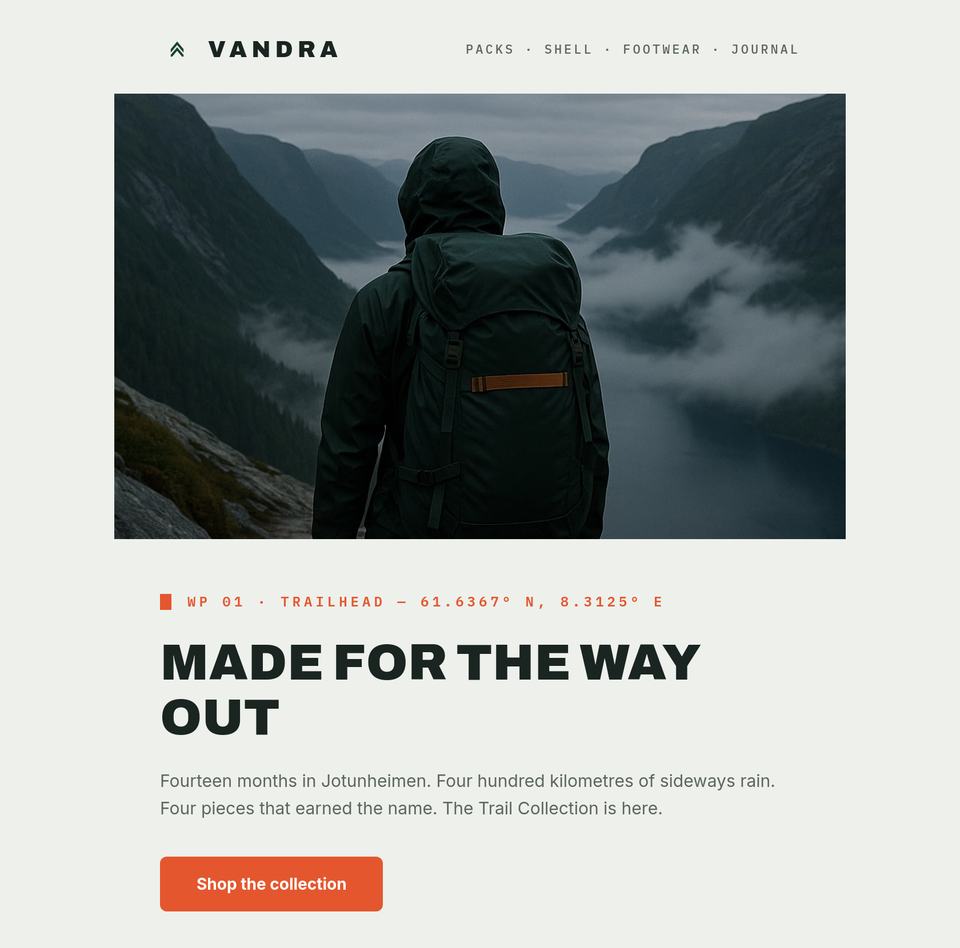

# Vandra

A complete example Design System for [Better Email](https://better.email),
kept as files: the emails of Vandra, a fictional Norwegian hiking-gear brand.
Eight Modules, a Template Base, and one Global script holding every brand
token.

The palette is trail-marker orange (`blaze`, #E4572E) on muted forest greens
and paper tones; type is Archivo for headlines, Inter for body, IBM Plex Mono
for waypoint labels. Every Module is a table-based, `role="presentation"`
layout with inline styles in a 640px container. CTAs are VML roundrects with
`mso` fallbacks, so Outlook renders real buttons. Web fonts degrade to
Helvetica/Arial/Courier stacks.

[](.github/sample-email.png)

*"The Trail Collection is here", a campaign built from these Modules. Click
through for [the full email](.github/sample-email.png).*

## Quickstart

```sh
npm install -g @better-email/cli
better login                  # browser sign-in; use an API key for CI

git clone https://github.com/betteremail/vandra
cd vandra
better ds push --create       # creates a Design System from these files and binds this directory
```

That's it — version 1 of your copy exists on the platform, ready to publish
from the app. Day-to-day:

```sh
better ds check               # file integrity, schema, setting keys, Module order
better ds dev                 # live preview in the app while you edit files locally
better ds diff                # what would change on the bound channel
better ds push                # saves a new version
```

Already have a Design System and want Vandra's files in it? Bind instead of
creating: `better ds bind <id>`, then `better ds diff` / `better ds push`.

`better ds push` never publishes to Live — publishing stays a human decision
in the app. `better ds check` works offline and needs no credentials.

## Modules

| Module | What it does |
| --- | --- |
| Hero | Full-bleed image, mono waypoint label, uppercase headline, optional CTA |
| Personal note | Short letter-style block for founder/team notes |
| Product grid | Product cards with pricing and per-tier sale badges |
| Field notes | Editorial story block — image, kicker, body, link |
| Members banner | Dark-surface membership/community callout |
| Testimonial | Customer quote with attribution |
| Values strip | Compact row of brand promises |
| Outro | Closing CTA section |

Header and footer live in the Template Base (`base.liquid`).

## File layout

```
design-system.json        version, content zones, Design System metadata
base.liquid               the email skeleton, including {{ content }}
settings.json             Global script (brand tokens) + Shared + Template settings
modules.order             one Module directory per line; this is the picker order
modules/<key>/
  module.json             id, key, name, hidden, metadata
  module.liquid           the Module's HTML
  settings.json           the Module's marketer-facing inputs
```

Every JSON file carries a `$schema` link, so an editor with JSON Schema
support autocompletes input types, constraints and metadata as you type. The
[Better Email VS Code extension](https://marketplace.visualstudio.com/items?itemName=better-email.better-email-design-systems)
adds Liquid autocomplete for settings and the render context.

## Brand tokens

All colors, font stacks, and shared asset URLs are defined once, in the
Global script at the top of `settings.json` (``), and
referenced everywhere as `{{ global.<key> }}`. Rebranding is editing that one
block.

## CI

Wire this repo to the review-and-push flow with the
[Design System GitHub Action](https://github.com/betteremail/design-system-action):
diff comments on pull requests, a new version on merge to main.

## Learn more

- [Design system development docs](https://learn.better.email/docs/design-system-development)
- [New to design systems?](https://better.email/features/design-system)

## License

[MIT](LICENSE). The Vandra brand is fictional; imagery is hosted by Better
Email and free to keep using while you customize.
